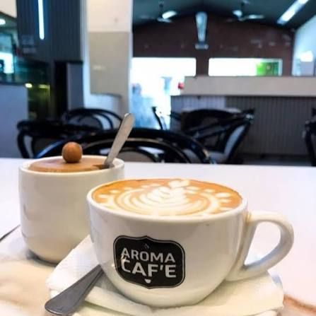

# ☕ Aroma Cafe

A fully responsive front-end website for a fictional cafe — built from scratch with plain HTML, CSS, and JavaScript, no frameworks.

🔗 **Live Demo:** https://sahapreeth23-rock-it.github.io/Cafe_Menu/



## ✨ Features

- **Responsive design** — clean layout on desktop, tablet, and mobile, with a collapsible hamburger navigation menu on small screens
- **Interactive menu** — clickable category cards (Coffee, Desserts, Snacks) that open detail popups with full item lists
- **Full price table** — quick-reference menu with item, category, and price
- **Reservation form** — client-side validation for name, email, guest count, date, and time, with inline error messages and a success confirmation
- **Smooth animations** — entrance animations on menu cards and a pulsing highlight on the day's special offer

## 🛠️ Built with

- HTML5
- CSS3 — Flexbox, media queries, keyframe animations
- Vanilla JavaScript — DOM manipulation, form validation, no libraries

## 📁 Project structure

```
├── index.html
├── style.css
├── script.js
├── README.md
└── images/
    ├── hero.jpg
    ├── coffee.jpg
    ├── desserts.jpg
    └── snacks.jpg
```

## 🚀 Run it locally

No build step or server required.

```bash
git clone https://github.com/sahapreeth23-rock-it/Cafe_Menu.git
cd Cafe_Menu
```

Then just open `index.html` in your browser.

## 📌 What I learned

Building this project helped me practice:
- Structuring a multi-section page with semantic HTML
- Writing responsive CSS with Flexbox and media queries
- Handling DOM events and form validation in vanilla JavaScript
- Deploying a static site with GitHub Pages

## 📄 License

This project is open source and available for learning purposes.
